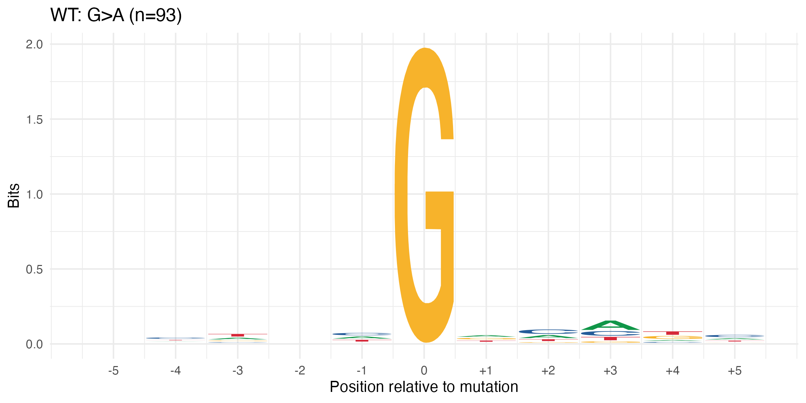
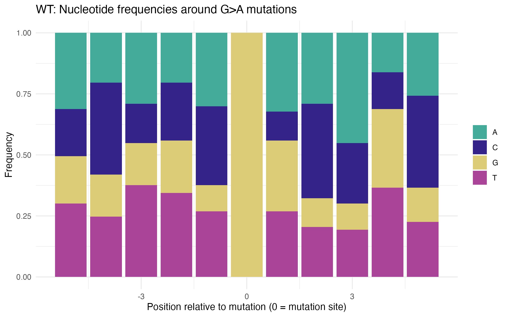
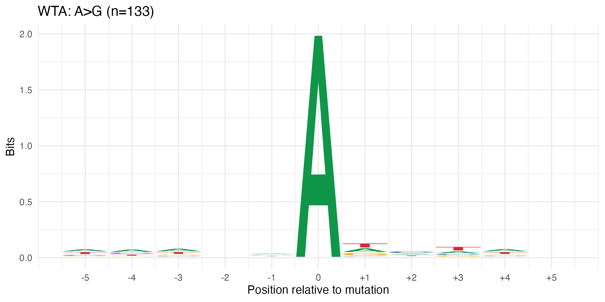
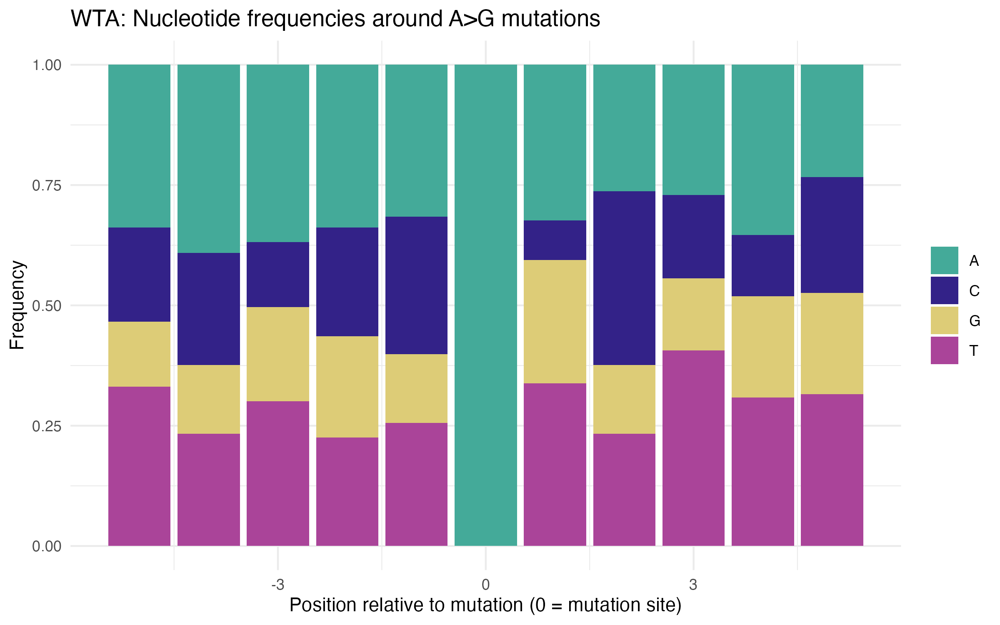
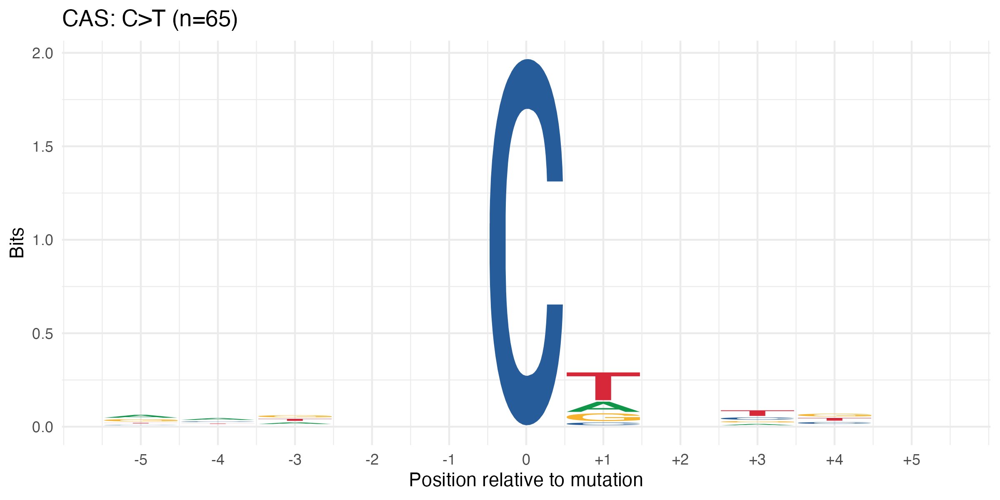
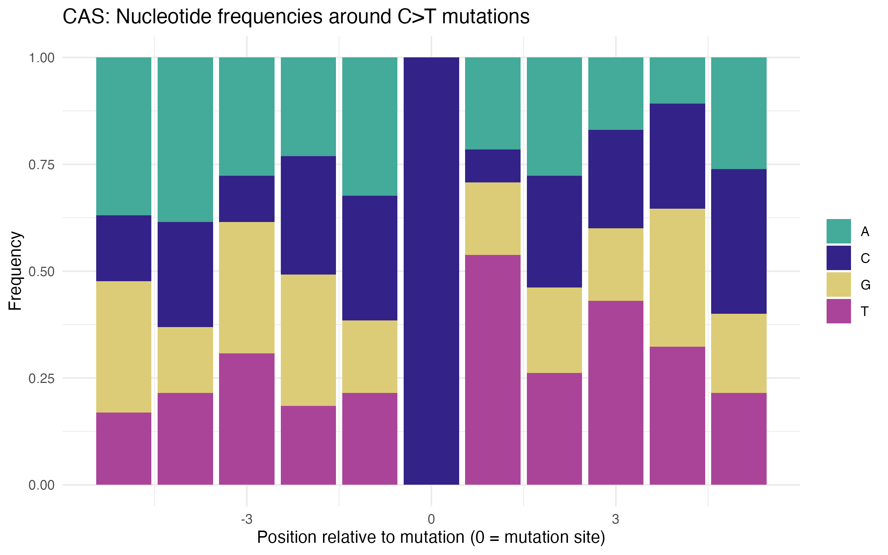
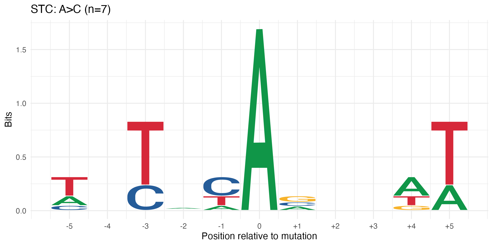
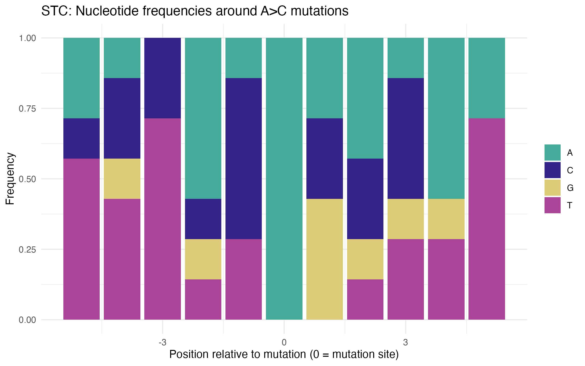

# Sequence Context Analysis Results

## Overview

This analysis examined the nucleotide sequences surrounding mutation sites for each treatment.
Sequence contexts can provide insights into the molecular mechanisms underlying these mutations.

## Dominant Mutation Contexts

### WT Treatment (G>A)

Nucleotide frequency distribution:

The G>A mutations show characteristic patterns consistent with
oxidative damage to guanine, which can form 8-oxoG that mispairs with adenine.

### WTA Treatment (A>G)

Nucleotide frequency distribution:

The A>G bias is complementary to WT's G>A pattern, suggesting
WTA may affect the same mechanism but on opposite DNA strands.

### CAS Treatment (C>T)

Nucleotide frequency distribution:

The C>T mutations are characteristic of cytosine deamination,
which creates uracil that pairs with adenine during replication.
CAS treatment may specifically affect the pathways that repair this damage.

### STC Treatment (A>C)

Nucleotide frequency distribution:

STC shows the most diverse mutation spectrum, which may reflect
its impact on multiple repair pathways simultaneously.

## Biological Implications

The sequence contexts identified in this analysis suggest these potential mechanisms:

1. **WT (G>A bias)**: Potential oxidative damage to guanine, creating 8-oxoG that mispairs with adenine
2. **WTA (A>G bias)**: Possible deamination of adenine to hypoxanthine, which pairs with cytosine
3. **CAS (C>T bias)**: Classic cytosine deamination signature, creating uracil that pairs with adenine
4. **STC (diverse patterns)**: Multiple damage mechanisms affecting different nucleotide contexts

## Conclusion

The sequence context patterns provide additional evidence that these treatments affect specific
DNA damage or repair mechanisms rather than causing random mutations. The complementary patterns
between WT and WTA are particularly striking and support our previous observations about their relationship.
